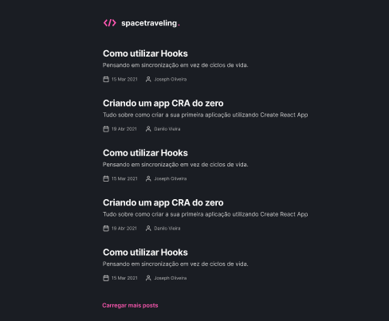

<div align="center">
  
</div>

<h3 align="center">Desafio Ignite Reactjs: Criando um projeto do zero</h3>

## :rocket: Sobre o desafio

Nesse desafio, o objetivo era criar um blog do zero,consumir os dados do Prismic e ter a interface implementada conforme o layout disponiblizado no Figma

## :computer: Como executar

Para executar a aplicação é necessário instalar as dependências utilizando o comando ```yarn``` e após executar o comando ```yarn dev```

## ✨ Tecnologias e Recursos utilizados

Esse projeto foi desenvolvido com as seguintes tecnologias:

- Estilizações global, comun e individuais;
- Importação de fontes Google;
- Paginação de posts;
- Cálculo de tempo estimado de leitura do post;
- Geração de páginas estáticas com os métodos `getStaticProps` e `getStaticPaths`;
- Formatação de datas com `date-fns`;
- Uso de ícones com `react-icons`;
- Requisições HTTP com `fetch`;
- [React](https://reactjs.org)
- [Next.js](https://nextjs.org/)
- [TypeScript](https://www.typescriptlang.org/)
- [Chakra Ui](https://chakra-ui.com/)
